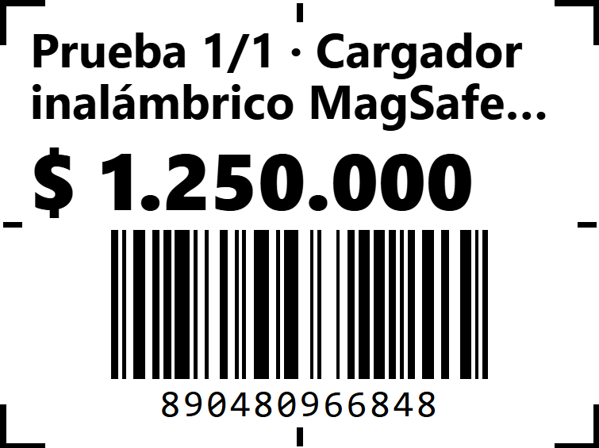

# Guía: imprimir etiquetas con la impresora PT-260

- **Para:** CelFashion.
- **Qué necesita:** la impresora PT-260 con su rollo de etiquetas, el cable USB, el computador con Windows, una regla y el lector de códigos de barras.
- **Tiempo aproximado:** 30 a 45 minutos.

Esta guía le ayuda a dejar la impresora lista para imprimir las etiquetas de
precio desde G-Pulso. Al final le pedimos unas fotos por WhatsApp para confirmar
que todo quedó bien.

---

## Paso 1. Conseguir el programa de la impresora (driver)

Windows necesita un programa llamado **driver** para usar la impresora. Búsquelo
en este orden y use el **primero** que encuentre:

1. **En la caja de la impresora:** un CD o un código QR impreso.
2. **Con el vendedor que se la vendió:** revise la página donde la compró, el
   chat de la compra o su correo. Pídale el "driver para Windows de la PT-260".
3. **Solo si no lo consigue de ninguna de las dos formas anteriores:** pídanos el
   enlace alternativo por WhatsApp. Antes de abrir ese archivo:
   - Entre a **www.virustotal.com**.
   - Pulse **Choose file** y suba el archivo que descargó.
   - Espere el resultado. **Si aparece algún aviso en rojo, NO lo abra** y
     mándenos una foto de la pantalla.

## Paso 2. Instalar el driver

1. Conecte la impresora al computador con el cable USB y enciéndala.
2. Si Windows muestra solo una ventana para "instalar el dispositivo", ciérrela
   o cancélela.
3. Abra el driver que consiguió en el Paso 1 y siga las instrucciones de
   instalación. Si le pide elegir un modelo y aparece **"TSC DA200"**, elija ese.
4. Al terminar, la impresora aparece en Windows con el nombre del driver (por
   ejemplo **TSC DA200**).

## Paso 3. Averiguar qué tipo de rollo tiene y medir la etiqueta

Esto se hace **con el rollo puesto** en la impresora.

1. Presione **una sola vez** el botón de avance de la impresora (el botón que
   saca papel).
2. Mire qué pasa:
   - **Si sale un pedazo y se detiene solo:** su rollo es **de etiquetas
     separadas** (troqueladas). La impresora reconoce dónde termina cada
     etiqueta. ¡Perfecto!
   - **Si sigue saliendo papel sin detenerse**, o no hay espacios entre las
     etiquetas: su rollo es **continuo**.
3. Con una regla, mida **una etiqueta**:
   - **Ancho:** debería ser 40 mm.
   - **Alto:** de arriba abajo, **sin contar el espacio** entre una etiqueta y
     la siguiente. Suele ser 30, 40 o 50 mm.
   - **Espacio entre etiquetas:** normalmente 2 o 3 mm.
4. Anote las tres medidas: las va a usar en los pasos 4 y 5.

## Paso 4. Crear el tamaño de etiqueta en el driver

1. Abra la configuración de impresoras de Windows:
   - **Windows 11:** Inicio → Configuración → Bluetooth y dispositivos →
     Impresoras y escáneres.
   - **Windows 10:** Inicio → Panel de control → Dispositivos e impresoras.
2. Entre a la impresora (TSC DA200) → **Preferencias de impresión**.
3. Busque la opción de **tamaño de papel o de etiqueta** (en el driver TSC está
   en **Configurar página → Stock → Nuevo**) y cree uno nuevo:
   - **Nombre:** por ejemplo `40x30`.
   - **Ancho:** 40 mm.
   - **Alto:** el alto que midió en el Paso 3.
4. En el **tipo de papel** elija:
   - **Etiquetas con separación** ("Labels with Gaps") si su rollo se detuvo solo
     en el Paso 3. Si le pide la separación, ponga la que midió.
   - **Continuo** ("Continuous") si no se detuvo.
5. Guarde y deje ese tamaño como **predeterminado**.

## Paso 5. Configurar la etiqueta en G-Pulso

1. Entre a **g-pulso.vercel.app** con su usuario de **administrador**.
2. En el menú de la izquierda, abra **Análisis y admin → Configuración** y, en la
   lista de secciones, elija **Etiquetas**.
3. En **Impresora de etiquetas**, elija:
   - **Rollo troquelado** si en el Paso 3 el papel se detuvo solo.
   - **Rollo continuo** si no se detuvo.
4. En **Tamaño de etiqueta**, pulse el botón con su medida: **40×30**, **40×40**
   o **40×50**. Si su alto es otro, pulse **Personalizado** y escriba el ancho
   (40) y el alto que midió.
5. Deje marcados **Nombre del producto** y **Precio**.
6. Pulse **Guardar cambios**.

## Paso 6. Imprimir la etiqueta de prueba

Esta prueba **no necesita productos cargados**. Imprime un producto de ejemplo
con **marcas en los bordes** para ver si la impresión cae justo sobre la
etiqueta.

1. En la misma pantalla de **Etiquetas**, pulse **Imprimir 1 de prueba
   (centrado)**.
2. En la ventana de impresión revise:
   - **Destino:** su impresora (TSC DA200).
   - Pulse **Más opciones** y ajuste:
     - **Tamaño del papel:** el que creó en el Paso 4 (`40x30`).
     - **Márgenes:** Ninguno.
     - **Escala:** Predeterminada (100 %).
     - **Encabezados y pies de página:** sin marcar.
3. Pulse **Imprimir**.
4. Mire la etiqueta. Tiene **8 marcas**: una en cada esquina (en forma de L) y
   una en la mitad de cada lado.

   

   *Así debe verse: las 4 esquinas en L y las 4 marcas de la mitad, completas.*

   - **Bien:** se ven **las 8 marcas completas**, pegadas a los bordes de la
     etiqueta, y nada se pasa a la etiqueta siguiente.
   - Si falta alguna marca o todo sale corrido, vaya a **Si algo sale mal**.
5. **Tómele una foto** de cerca, con buena luz.

## Paso 7. Imprimir 10 seguidas

1. Pulse **Imprimir 10 seguidas (alineación)** y use los mismos ajustes del
   Paso 6.
2. Revise que la **décima** etiqueta quede tan bien ubicada como la primera.
3. **Tómeles una foto** a las 10 juntas, sin despegarlas del rollo.

## Paso 8. Etiqueta de un producto real (cuando tengan productos)

Esto se hace **cuando ya hayan cargado productos** en G-Pulso.

1. Abra **Inventario → Productos**, busque un producto y ábralo.
2. Pulse el botón **Etiquetas**.
3. Elija cuántas quiere con **+** y **−** y pulse **Imprimir**, con los mismos
   ajustes del Paso 6.
4. **Pruebe el lector:**
   - Abra el **Bloc de notas** de Windows (Inicio → escriba "Bloc de notas").
   - Escanee la etiqueta con el lector.
   - Deben aparecer **exactamente los mismos números** que están impresos debajo
     de las barras, **al primer intento**.
   - Anote cuántas veces tuvo que pasar el lector.
5. Más adelante, en un día normal de ventas (con el turno de caja abierto),
   escanee una etiqueta en **Operación → Ventas**: el producto debe entrar al
   carrito.

---

## Qué mandarnos por WhatsApp

1. La **foto de la etiqueta de prueba** (Paso 6).
2. La **foto de las 10 seguidas** (Paso 7).
3. Las **medidas** de su etiqueta (Paso 3) y si el rollo **se detuvo solo** con
   el botón de avance.
4. Cuando tengan productos: la **foto de la etiqueta de un producto** y si el
   lector **leyó al primer intento** (sí / no / cuántos intentos).

---

## Si algo sale mal

**Sale cortada (falta una parte del texto, del código o de alguna marca)**
- Revise en el Paso 5 que el tamaño en G-Pulso sea igual a la etiqueta medida.
- Revise en la ventana de impresión: márgenes **Ninguno** y escala **100 %**.
- 📷 **Mande:** foto de la etiqueta de prueba, indicando qué lado se corta.

**Sale corrida (la impresión se sale de la etiqueta o se pasa a la siguiente)**
- Revise en el Paso 4 que el driver tenga el **mismo alto** que midió y el tipo
  de papel correcto (con separación o continuo).
- Presione una vez el botón de avance e intente de nuevo.
- 📷 **Mande:** foto de las 10 seguidas y foto de la pantalla del tamaño de
  papel del driver (Paso 4).

**No imprime nada**
- Revise que la impresora esté encendida, con rollo y conectada por USB.
- En la ventana de impresión, revise que el **Destino** sea la PT-260 (TSC DA200)
  y no otra impresora ni "Guardar como PDF".
- 📷 **Mande:** foto de la ventana de impresión y de la pantalla de "Impresoras y
  escáneres" de Windows.

**El lector no lee el código, o necesita varios intentos**
- Pruebe con la etiqueta pegada sobre algo plano, sin arrugas, y acerque o aleje
  un poco el lector.
- 📷 **Mande:** foto de cerca de la etiqueta (que se vean bien las barras y los
  números de abajo) y díganos la marca del lector si la tiene a la mano.

**Cualquier otra cosa**
- 📷 **Mande:** una foto de la pantalla y una de la etiqueta, y cuéntenos qué
  paso de esta guía estaba haciendo.
